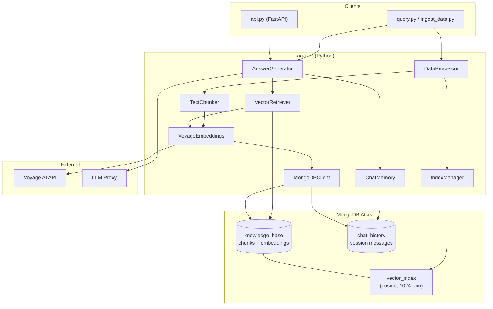
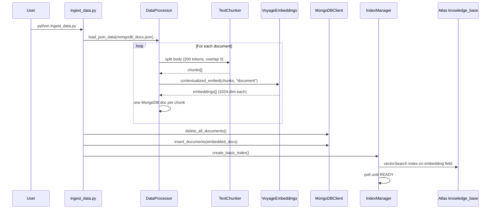
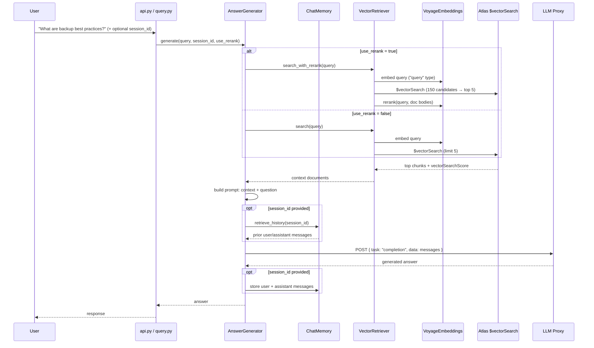
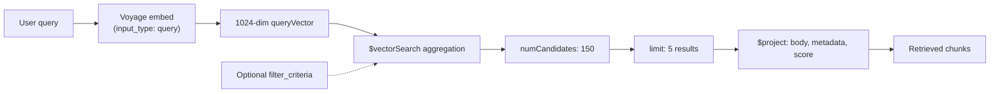
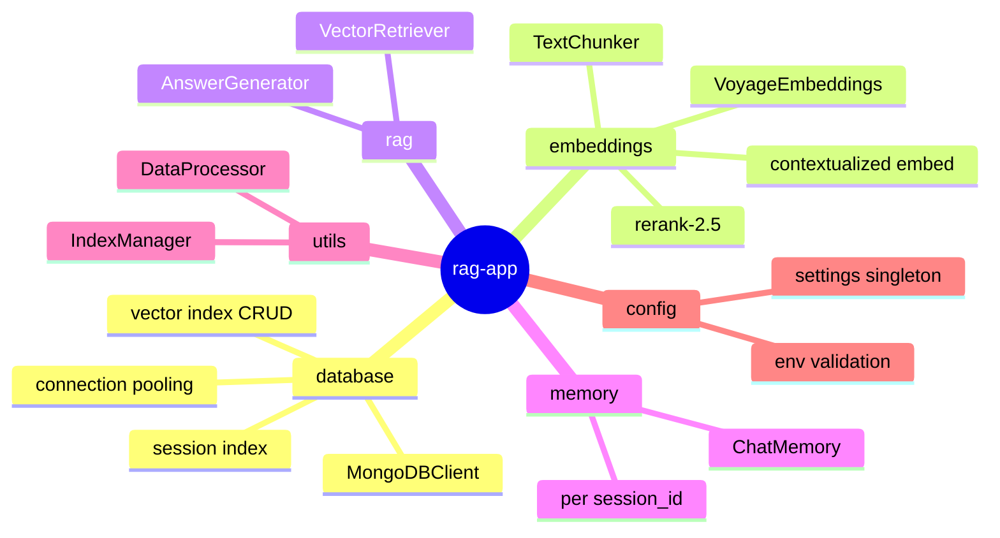
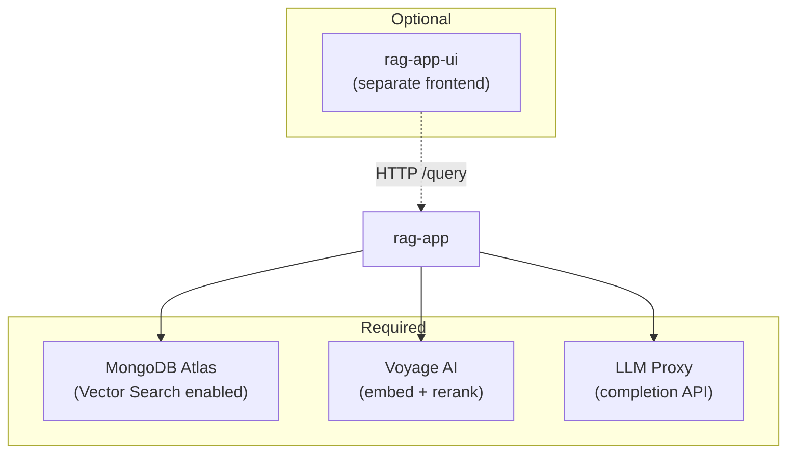
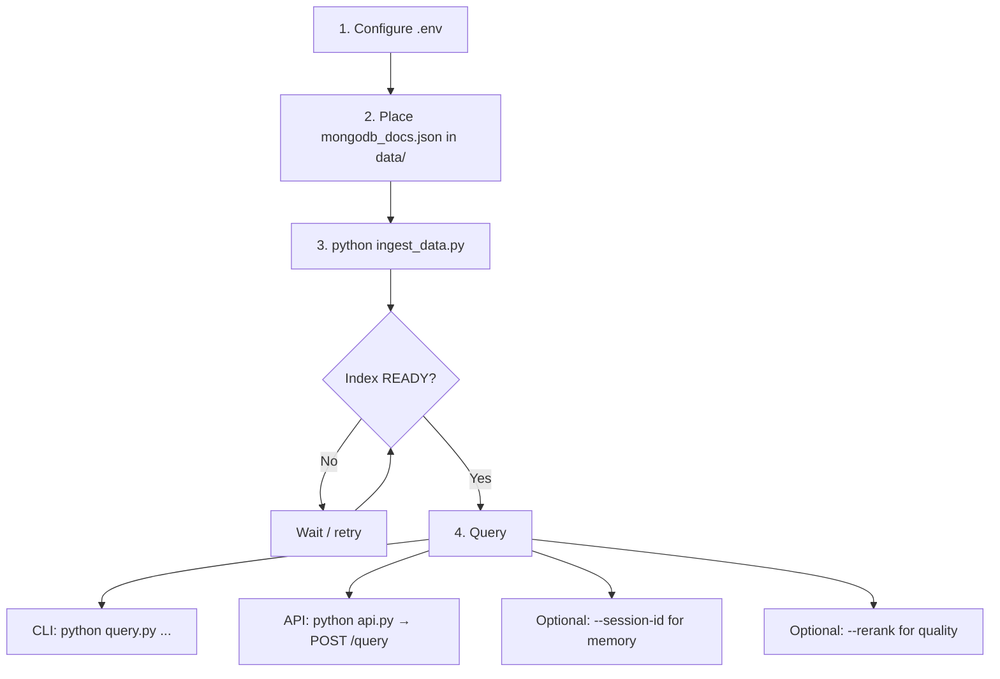

# Architecture Overview

This document describes the architecture of the MongoDB RAG application (`rag-app`).

## What It Does

A **Retrieval-Augmented Generation (RAG)** application built for MongoDB's GenAI Developer Day. It answers questions about MongoDB documentation by retrieving relevant chunks from **MongoDB Atlas Vector Search** and generating answers with an **LLM** — grounded in retrieved context, not model memory alone.

## High-Level Architecture



## Project Structure

```
rag-app/
├── api.py                 # REST API (FastAPI)
├── ingest_data.py         # One-time / periodic data load
├── query.py               # CLI query interface
├── config/settings.py     # All tunables + env vars
├── data/mongodb_docs.json # Source documents (you provide this)
└── src/
    ├── database/mongodb.py
    ├── embeddings/{chunker,voyage_embeddings}.py
    ├── rag/{retriever,generator}.py
    ├── memory/chat_history.py
    └── utils/{data_loader,index_manager}.py
```

## Technology Stack

| Layer | Technology |
|-------|------------|
| Vector DB | MongoDB Atlas (`$vectorSearch`) |
| Embeddings | Voyage AI `voyage-context-3` (1024-dim, contextualized) |
| Chunking | LangChain `RecursiveCharacterTextSplitter` |
| LLM | External proxy (`PROXY_ENDPOINT`) |
| API | FastAPI (`api.py`) |
| CLI | `ingest_data.py`, `query.py` |

## Flow 1: Data Ingestion



Each chunk document preserves original metadata (`metadata.productName`, `metadata.contentType`, `updated`, etc.), replaces `body` with the chunk text, and adds a 1024-float `embedding` vector from Voyage.

Chunking uses tiktoken (GPT-4 encoder) with separators `["\n\n", "\n", " ", "", "#", "##", "###"]` so markdown-style docs split sensibly.

## Flow 2: Query / RAG Pipeline



The system is **grounded**: if retrieval returns nothing useful, the model is instructed to say *"I DON'T KNOW"* rather than hallucinate.

## Vector Search Internals



| Setting | Value | Purpose |
|---------|-------|---------|
| `NUM_CANDIDATES` | 150 | ANN search pool size |
| `VECTOR_SEARCH_LIMIT` | 5 | Chunks passed to LLM |
| `RERANK_TOP_K` | 5 | After reranking |
| Similarity | cosine | Vector distance metric |
| Index name | `vector_index` | Atlas search index |

**Pre-filtering** (advanced): `IndexManager.create_index_with_filters()` adds filter fields (e.g. `metadata.productName`) so `VectorRetriever.search(filter_criteria={...})` can narrow results before similarity ranking.

## Module Responsibilities



| Module | File | Role |
|--------|------|------|
| **Database** | `mongodb.py` | Connects to `mongodb_genai_devday_rag`; manages `knowledge_base` + `chat_history` |
| **Embeddings** | `voyage_embeddings.py` | `contextualized_embed` for docs/queries; `rerank` for relevance boost |
| **Embeddings** | `chunker.py` | Splits long docs into ~200-token chunks |
| **RAG** | `retriever.py` | Builds `$vectorSearch` pipeline, optional rerank |
| **RAG** | `generator.py` | Orchestrates retrieve → prompt → LLM → memory |
| **Memory** | `chat_history.py` | Stores `{session_id, role, content, timestamp}` in MongoDB |
| **Utils** | `data_loader.py` | JSON load + chunk + embed pipeline |
| **Utils** | `index_manager.py` | Creates Atlas vector index, waits for READY |
| **Config** | `settings.py` | Central config from `.env` |

## MongoDB Collections

| Collection | Purpose |
|------------|---------|
| `knowledge_base` | Document chunks + embeddings |
| `chat_history` | Per-session conversation messages |

## API Surface (`api.py`)

On startup, the API wires all components once: `MongoDBClient` → `VoyageEmbeddings` → `VectorRetriever` → `ChatMemory` → `AnswerGenerator`.

| Endpoint | Method | Purpose |
|----------|--------|---------|
| `/` | GET | API info |
| `/health` | GET | MongoDB + embeddings health |
| `/stats` | GET | Doc count, model, chunk size |
| `/query` | POST | Full RAG answer |
| `/search` | GET | Raw vector search (no LLM) |
| `/history/{session_id}` | GET | Fetch chat history |
| `/history/{session_id}` | DELETE | Clear session |

**Example query request:**

```json
{
  "query": "What are best practices for MongoDB backups?",
  "session_id": "user123",
  "use_rerank": false
}
```

## Configuration & Dependencies

**Required env vars** (`.env`):

- `MONGODB_URI` — Atlas connection string
- `PROXY_ENDPOINT` — LLM completion proxy URL
- `VOYAGE_API_KEY` — or workshop `PASSKEY` via proxy



## Design Choices

1. **Contextualized embeddings** — Voyage's `voyage-context-3` embeds chunks *in document context*, which tends to improve retrieval vs. naive per-chunk embedding.
2. **Two-stage retrieval** — Vector search casts a wide net (150 candidates); optional reranking (`rerank-2.5`) re-scores the top bodies for sharper relevance.
3. **MongoDB as dual store** — Same database holds vectors *and* chat memory; no separate vector DB or Redis needed.
4. **Modular CLI + API** — Same core classes power both `query.py` and `api.py`; ingestion is a separate offline job.
5. **Session memory** — History is stored in MongoDB keyed by `session_id`, enabling multi-turn conversations.

## Typical Usage Lifecycle


